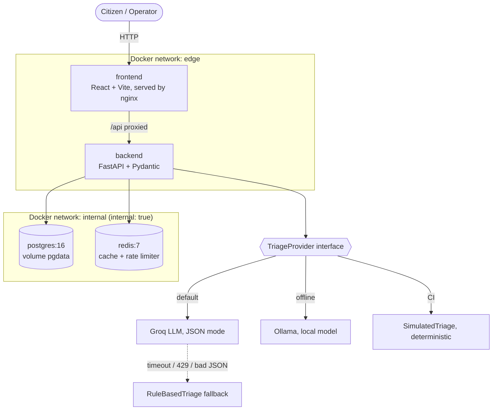
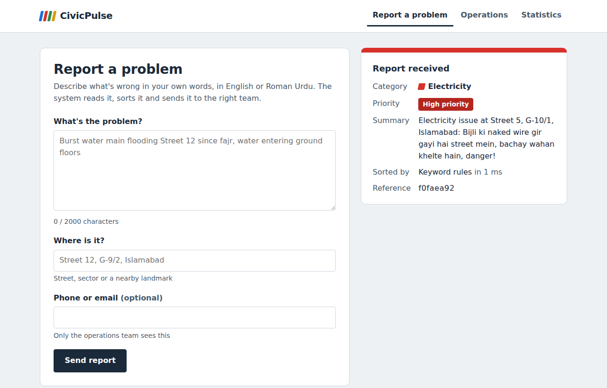
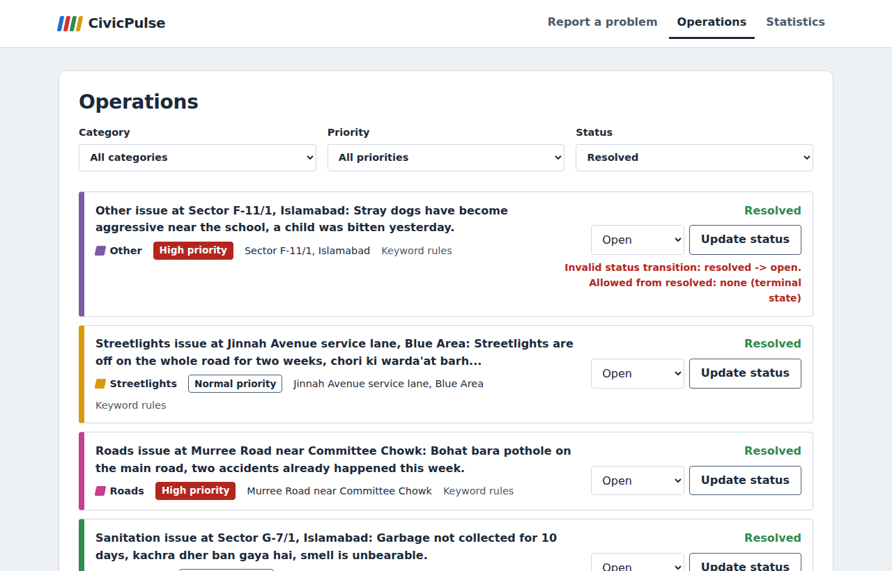
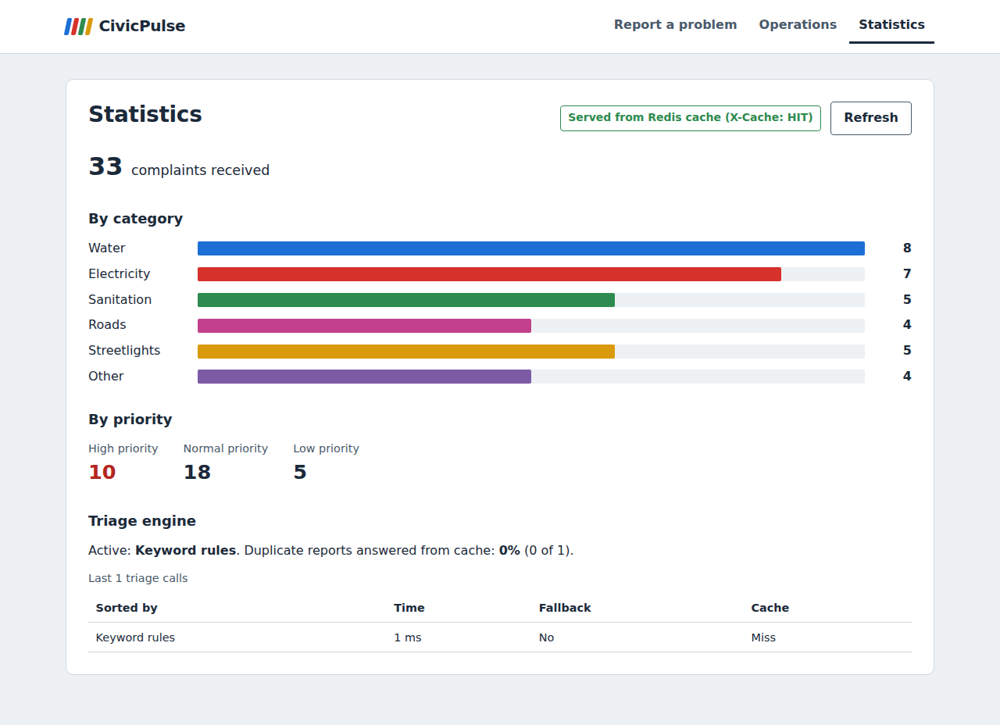

# CivicPulse

[](https://github.com/RoshailAhmad/CivicPulse/actions/workflows/ci.yml)
[](https://github.com/RoshailAhmad/CivicPulse/actions/workflows/cd.yml)

Municipal complaint intake, AI triage and operations platform.
CS4032 Software Construction and Design, Assignment 01.

## The problem

A citizen types *"burst water main flooding Street 12 since fajr, water entering ground
floors"* into a form. In most cities that text lands in one unsorted queue, behind three
streetlight complaints, because nothing read it. Dropdowns don't fix it: citizens pick the
wrong category or "Other", and they can't judge urgency. The information is in the text.

CivicPulse reads every complaint with a language model, assigns a **category**, a
**priority** and a **one-line summary**, stores it durably and shows it on a live
operations dashboard. The reader is replaceable (hosted LLM, local model, keyword rules),
and when the clever one is slow, rate-limited or wrong, the system falls back to rules.
A citizen never sees an error because a third party failed.

## Architecture



The frontend is only on `edge`, so it has no route to the database. The backend is the
only service on both networks. See [docs/ENGINEERING-NOTES.md](docs/ENGINEERING-NOTES.md).

## Quickstart (one command)

Requires Docker Desktop (with Compose v2) and Git.

```bash
git clone https://github.com/RoshailAhmad/CivicPulse.git
cd CivicPulse
cp .env.example .env          # Windows PowerShell: copy .env.example .env
docker compose up --build
```

Open **http://127.0.0.1:8080**. The database is migrated and seeded with 32 realistic
complaints automatically. API docs: **http://127.0.0.1:8000/docs**.

To use the real AI model, put a free Groq key in `.env` (`TRIAGE_PROVIDER=llm`,
`LLM_API_KEY=...`) and restart. Without a key the app uses keyword rules.

**Kubernetes (k3d):** see [docs/RUNBOOK.md](docs/RUNBOOK.md) for the second command:
`kubectl apply -k k8s/overlays/dev`.

## Screenshots

| Report a problem | Operations | Statistics |
|---|---|---|
|  |  |  |

The Operations view shows the server's 409 message word for word when a status change
isn't allowed. The Statistics view shows whether the numbers came from the Redis cache
(`X-Cache: HIT`) or the database (`MISS`).

## API

| Method | Path | Behaviour |
|---|---|---|
| POST | `/api/complaints` | Validate, triage, persist. `201`; `400` with field errors; `429` + `Retry-After` over the rate limit |
| GET | `/api/complaints/{id}` | `200` / `404` |
| GET | `/api/complaints` | Filter by `category`, `priority`, `status`; paginate with `page`, `page_size` (max 100); returns `total` |
| PATCH | `/api/complaints/{id}/status` | Enforces the state machine; invalid transition is `409` naming it |
| GET | `/api/stats` | Aggregates, Redis-cached for 30 s, `X-Cache: HIT` or `MISS`, invalidated on every write |
| GET | `/api/meta/providers` | Active triage provider, last 20 triage outcomes, triage cache hit rate |
| GET | `/health` | Liveness. Never touches the database |
| GET | `/ready` | Readiness. `200` only if Postgres and Redis respond; `503` naming the failed one |
| GET | `/metrics` | Prometheus: request count and latency, triage latency, fallback counter |

Status state machine: `open → in_progress → resolved`, `open → rejected`,
`in_progress → rejected`. `resolved` and `rejected` are terminal.

## How it's built

| Area | Choice |
|---|---|
| Backend | FastAPI + Pydantic v2, SQLAlchemy 2, Alembic, four layers (routes, services, repositories, providers) |
| AI triage | `TriageProvider` protocol with Groq, Ollama, rules and simulated implementations ([docs/TRIAGE.md](docs/TRIAGE.md)) |
| Frontend | React 18 + Vite + TypeScript, API client typed from the backend's OpenAPI schema |
| Data | PostgreSQL 16 (migrations, seed), Redis 7 (stats cache, triage cache, rate limiter, AOF) |
| Containers | Multi-stage, pinned, non-root images; Compose with two networks and three volumes |
| Kubernetes | Kustomize base + dev/prod overlays, StatefulSet, HPA, VPA (recommend only), PDB, Ingress |
| CI/CD | GitHub Actions: lint, types, tests, Trivy, kubeconform, Compose integration; CD pushes to GHCR by commit SHA and deploys to an ephemeral k3d cluster |

## Tests

```bash
cd backend && pip install -r requirements-dev.txt && pytest   # 41 tests, ~93% coverage
cd frontend && npm ci && npm test                              # 7 component tests
```

CI pins triage to `SimulatedTriage`, so the suite gives the same result on every run. The
test that matters most: when the provider always fails, `POST /api/complaints` still
returns `201` with `triaged_by = "rules:fallback"`.

## Documentation

- [docs/RUNBOOK.md](docs/RUNBOOK.md): deploy, roll back, read logs, triage failing
- [docs/ENGINEERING-NOTES.md](docs/ENGINEERING-NOTES.md): the eight questions, with file and line references
- [docs/TRIAGE.md](docs/TRIAGE.md): how the AI layer works and how it fails safely
- [docs/adr/](docs/adr/): architecture decision records
- [docs/AI-USAGE.md](docs/AI-USAGE.md): where AI assistance was used

## Team

Roshail Ahmad and Mehak Ali.

## License

MIT, see [LICENSE](LICENSE).
